# Study Bible MCP - Agent Flow

## How It Works

```mermaid
flowchart TD
    User([User asks a biblical question])
    User --> Classify

    Classify{Agent classifies\nquestion type}

    %% === VERSE STUDY PATH ===
    Classify -->|"Specific verse\n(e.g. 'What does John 3:16 say?')"| LookupVerse
    LookupVerse["`**lookup_verse**
    Returns: English text,
    Greek/Hebrew original,
    word-by-word analysis,
    genre guidance`"]

    LookupVerse --> EnrichVerse{Enrich with\nmore context?}
    EnrichVerse -->|Key word stands out| WordStudy
    EnrichVerse -->|Want related passages| CrossRef
    EnrichVerse -->|Want people/places| GraphEnriched
    EnrichVerse -->|Want semantic parallels| SimilarPassages
    EnrichVerse -->|Want scholarly commentary| StudyNotes
    EnrichVerse -->|Want cultural background| ANEContext
    EnrichVerse -->|Sufficient| Respond

    %% === WORD/CONCEPT PATH ===
    Classify -->|"Word or concept\n(e.g. 'What does agape mean?')"| WordPath
    WordPath{Agent knows\nStrong's number?}
    WordPath -->|Yes| WordStudy
    WordPath -->|No, search by English| SearchLexicon

    SearchLexicon["`**search_lexicon**
    Returns: matching Greek/Hebrew
    entries with Strong's numbers`"]
    SearchLexicon --> WordStudy

    WordStudy["`**word_study**
    Returns: full lexicon entry,
    brief + full LSJ/BDB definition,
    etymology, semantic range`"]
    WordStudy --> FindUsage{Show usage\nin context?}
    FindUsage -->|Yes| SearchStrongs
    FindUsage -->|Want key term definition| KeyTerms
    FindUsage -->|Sufficient| Respond

    SearchStrongs["`**search_by_strongs**
    Returns: verses containing
    this Greek/Hebrew word`"]
    SearchStrongs --> Respond

    %% === PERSON/PLACE PATH ===
    Classify -->|"Person or place\n(e.g. 'Tell me about David')"| EntityPath
    EntityPath{Person or place?}

    EntityPath -->|Person| LookupName
    EntityPath -->|Place| ExplorePlaceTool

    LookupName["`**lookup_name**
    Returns: description,
    family relationships,
    key references,
    ACAI annotations`"]
    LookupName --> PersonDeepen{Go deeper?}
    PersonDeepen -->|Family tree| ExploreGenealogy
    PersonDeepen -->|Life events| ExploreEvents
    PersonDeepen -->|Connection to another| FindConnection
    PersonDeepen -->|Dictionary article| BibleDict
    PersonDeepen -->|Sufficient| Respond

    ExploreGenealogy["`**explore_genealogy**
    Returns: ancestor/descendant
    tree + Mermaid diagram`"]
    ExploreGenealogy --> Respond

    ExploreEvents["`**explore_person_events**
    Returns: chronological
    timeline + Mermaid diagram`"]
    ExploreEvents --> Respond

    FindConnection["`**find_connection**
    Returns: shortest relationship
    path + Mermaid flowchart`"]
    FindConnection --> Respond

    ExplorePlaceTool["`**explore_place**
    Returns: events, people
    born/died there, coordinates
    + Mermaid network diagram`"]
    ExplorePlaceTool --> Respond

    %% === THEOLOGY PATH ===
    Classify -->|"Theological theme\n(e.g. 'What does the Bible\nsay about salvation?')"| ThemePath
    ThemePath --> CrossRef

    CrossRef["`**get_cross_references**
    Returns: key passages
    for the theme/doctrine`"]
    CrossRef --> LookupVerse

    %% === COMMENTARY PATH ===
    Classify -->|"Commentary or background\n(e.g. 'Explain Romans 8:28')"| CommentaryPath
    CommentaryPath{What kind of\nreference?}

    CommentaryPath -->|Verse/chapter notes| StudyNotes
    CommentaryPath -->|Topical article| BibleDict
    CommentaryPath -->|Theological term| KeyTerms

    StudyNotes["`**get_study_notes**
    Returns: Aquifer Open Study Notes,
    UW Translation Notes,
    SIL Translator Notes`"]
    StudyNotes --> CommentaryDeepen{Go deeper?}
    CommentaryDeepen -->|Look up the verse text| LookupVerse
    CommentaryDeepen -->|Dictionary background| BibleDict
    CommentaryDeepen -->|Sufficient| Respond

    BibleDict["`**get_bible_dictionary**
    Returns: Tyndale Bible
    Dictionary article (500+
    topics, people, places)`"]
    BibleDict --> Respond

    KeyTerms["`**get_key_terms**
    Returns: FIA Key Terms
    definition, biblical usage,
    translation guidance`"]
    KeyTerms --> Respond

    %% === PASSAGE STUDY PATH ===
    Classify -->|"Passage exploration\n(e.g. 'Who is in Romans 8?')"| PassagePath

    PassagePath --> PeopleInPassage
    PeopleInPassage["`**people_in_passage**
    Returns: all people, places,
    events mentioned in
    the chapter/verse`"]
    PeopleInPassage --> Respond

    %% === DISCOVERY PATH ===
    Classify -->|"Thematic discovery\n(e.g. 'What passages are\nlike Isaiah 53?')"| DiscoveryPath

    DiscoveryPath --> SimilarPassages
    SimilarPassages["`**find_similar_passages**
    Returns: semantically similar
    passages via vector search,
    ranked by similarity score`"]
    SimilarPassages --> LookupVerse

    %% === DEEP DIVE PATH ===
    Classify -->|"Deep verse study\n(e.g. 'Unpack Matthew 1:1')"| DeepPath

    DeepPath --> GraphEnriched
    GraphEnriched["`**graph_enriched_search**
    Returns: verse text +
    all entities + family
    relationships for each`"]
    GraphEnriched --> EnrichVerse

    %% === CULTURAL CONTEXT PATH ===
    Classify -->|"Cultural background\n(e.g. 'ANE context of Genesis 15')"| ContextPath

    ContextPath --> ANEContext
    ANEContext["`**get_ane_context**
    Returns: ANE cultural entries
    with parallels, interpretive
    significance, scholarly sources`"]
    ANEContext --> ContextDeepen{Go deeper?}
    ContextDeepen -->|Look up the verse| LookupVerse
    ContextDeepen -->|Dictionary background| BibleDict
    ContextDeepen -->|Sufficient| Respond

    %% === GRAMMAR PATH ===
    Classify -->|"Grammar question\n(e.g. 'What does V-AAI-3S mean?')"| GrammarPath
    GrammarPath --> ParseMorph
    ParseMorph["`**parse_morphology**
    Returns: full grammatical
    breakdown (tense, voice,
    mood, person, number)`"]
    ParseMorph --> Respond

    %% === RESPONSE ===
    Respond([Agent synthesises response\nwith original languages,\ndiagrams, and citations])

    %% Styling
    style User fill:#4a90d9,stroke:#2c5f9e,color:#fff
    style Respond fill:#4a90d9,stroke:#2c5f9e,color:#fff
    style Classify fill:#f5a623,stroke:#d48b0a,color:#fff
    style EnrichVerse fill:#f5a623,stroke:#d48b0a,color:#fff
    style WordPath fill:#f5a623,stroke:#d48b0a,color:#fff
    style EntityPath fill:#f5a623,stroke:#d48b0a,color:#fff
    style PersonDeepen fill:#f5a623,stroke:#d48b0a,color:#fff
    style FindUsage fill:#f5a623,stroke:#d48b0a,color:#fff
    style CommentaryPath fill:#f5a623,stroke:#d48b0a,color:#fff
    style CommentaryDeepen fill:#f5a623,stroke:#d48b0a,color:#fff
    style ContextDeepen fill:#f5a623,stroke:#d48b0a,color:#fff

    style LookupVerse fill:#7ed321,stroke:#5a9e18,color:#fff
    style WordStudy fill:#7ed321,stroke:#5a9e18,color:#fff
    style SearchLexicon fill:#7ed321,stroke:#5a9e18,color:#fff
    style SearchStrongs fill:#7ed321,stroke:#5a9e18,color:#fff
    style CrossRef fill:#7ed321,stroke:#5a9e18,color:#fff
    style ParseMorph fill:#7ed321,stroke:#5a9e18,color:#fff
    style LookupName fill:#7ed321,stroke:#5a9e18,color:#fff
    style SimilarPassages fill:#9b59b6,stroke:#7d3c98,color:#fff
    style GraphEnriched fill:#9b59b6,stroke:#7d3c98,color:#fff
    style ExploreGenealogy fill:#e74c3c,stroke:#c0392b,color:#fff
    style ExploreEvents fill:#e74c3c,stroke:#c0392b,color:#fff
    style FindConnection fill:#e74c3c,stroke:#c0392b,color:#fff
    style ExplorePlaceTool fill:#e74c3c,stroke:#c0392b,color:#fff
    style PeopleInPassage fill:#e74c3c,stroke:#c0392b,color:#fff
    style StudyNotes fill:#3498db,stroke:#2178b5,color:#fff
    style BibleDict fill:#3498db,stroke:#2178b5,color:#fff
    style KeyTerms fill:#3498db,stroke:#2178b5,color:#fff
    style ANEContext fill:#e67e22,stroke:#cf6d17,color:#fff
```

## Tool Colour Key

| Colour | Category | Tools |
|--------|----------|-------|
| Green | Core text & language | lookup_verse, word_study, search_lexicon, search_by_strongs, get_cross_references, parse_morphology, lookup_name |
| Purple | Hybrid search | find_similar_passages, graph_enriched_search |
| Red | Graph knowledge | explore_genealogy, explore_person_events, explore_place, find_connection, people_in_passage |
| Light blue | Scholarly commentary | get_study_notes, get_bible_dictionary, get_key_terms |
| Dark orange | Cultural context | get_ane_context |
| Orange | Agent decisions | Classification and enrichment decision points |
| Blue | User interaction | Question input and final response |

## Typical Tool Chains

**Simple verse lookup:**
User question → `lookup_verse` → response

**Word study deep dive:**
User question → `search_lexicon` → `word_study` →
`search_by_strongs` → response

**Person biography:**
User question → `lookup_name` → `explore_person_events` →
`explore_genealogy` → response

**Passage unpacking:**
User question → `graph_enriched_search` → `lookup_verse`
(for related verses) → `word_study` (for key terms) → response

**Thematic discovery:**
User question → `get_cross_references` → `lookup_verse`
(for each reference) → `find_similar_passages` → response

**Relationship tracing:**
User question → `find_connection` → `explore_genealogy`
(for context) → response

**Verse commentary:**
User question → `get_study_notes` → `lookup_verse`
(for the verse text) → `get_bible_dictionary` (for background) → response

**Theological term study:**
User question → `get_key_terms` → `word_study`
(for the Greek/Hebrew behind the term) → `search_by_strongs` → response

**Topical research:**
User question → `get_bible_dictionary` → `get_cross_references`
(for supporting passages) → `lookup_verse` → response

**Cultural context study:**
User question → `get_ane_context` → `lookup_verse`
(for the passage text) → `get_bible_dictionary` (for background) → response

**Deep passage study with ANE background:**
User question → `lookup_verse` → `get_study_notes` →
`get_ane_context` (for cultural illumination) → `word_study` → response
